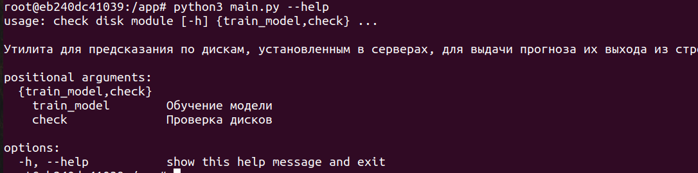
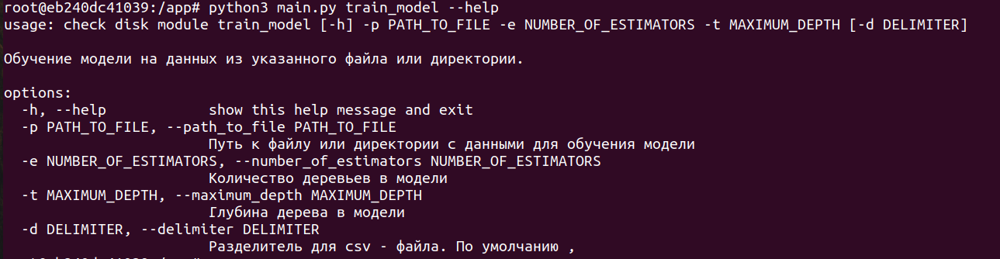
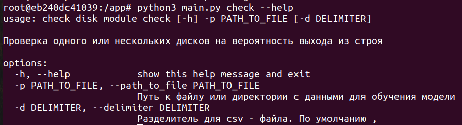
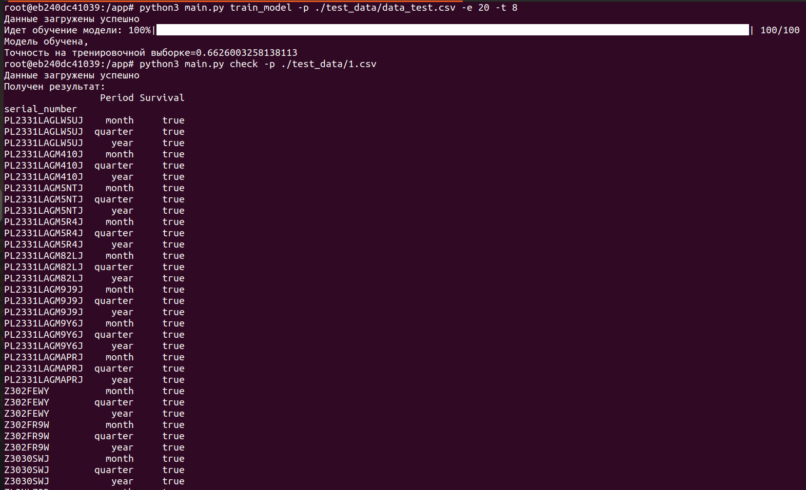

Данная задача решалась в рамках хакатона "Цифровой Прорыв 2024",
описание кейса в файле "Сила".\
Данные находятся в открытом доступе.\
Информация по датчикам взята с сайта: https://ru.wikipedia.org/wiki/S.M.A.R.T.

### Для запуска программы:
1.  Установите docker
2. При первом запуске выполнить следующие команды:
```
docker build . -t sila
docker run -it --name sila sila
```
При повторных использованиях:
```
docker start -i sila
```
3. Внутри контейнера вызвать меню с описанием возможностей системы.
```
python3 main.py --help
```
Система может обучить модель на загруженных данных и предсказать работу дисков на период: месяц, квартал и год.


Модуль train_model отвечает за обучение модели.


Модуль check отвечает за предсказания.


Работа системы выглядит следующим образом:


Блокнот Data_loader.ipynb собирает данные за период с 2021-по 2 кв.2024 в единый датасет по принципу:
- все диски с целевой меткой 1
- выборочно диски с меткой 0 для баланса классов из списка серийных номеров дисков с меткой 1. 
Данный датасет находится в папке data.
Блокнот Sila_module.ipynb содержит анализ признаков.

Целью данной работы было написание утилиты и встраивание в нее модели.\
Модель сделана на Random Survival Forest, максимальная метрика 0.69 на тестовых данных.

В папке test_data находятся данные для теста: файл для обучения модели и файлы для тестирования.


